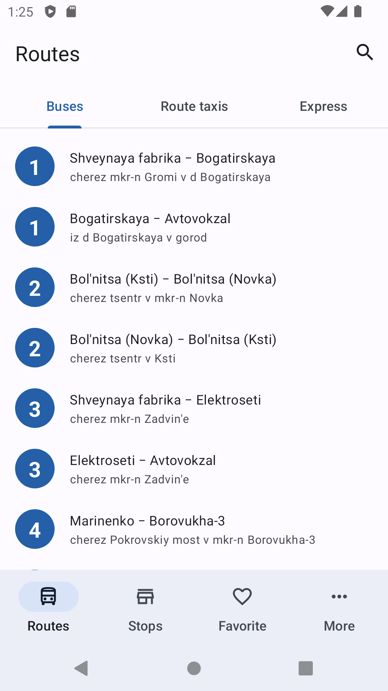
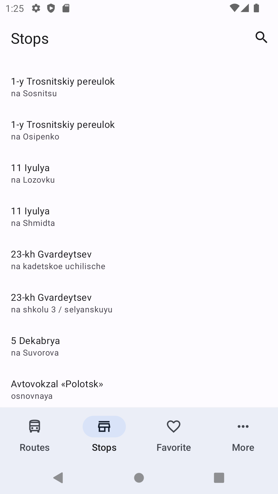
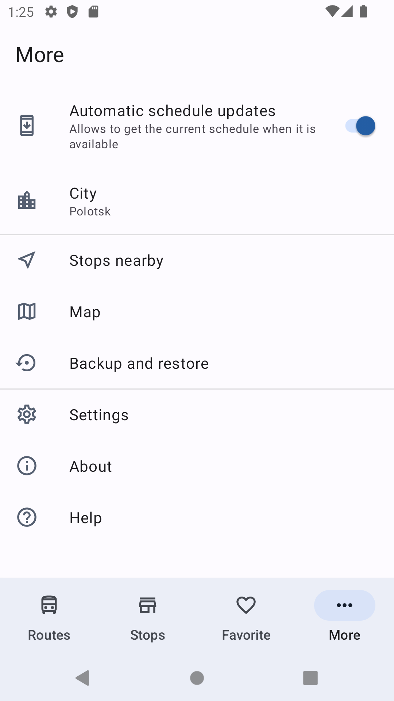
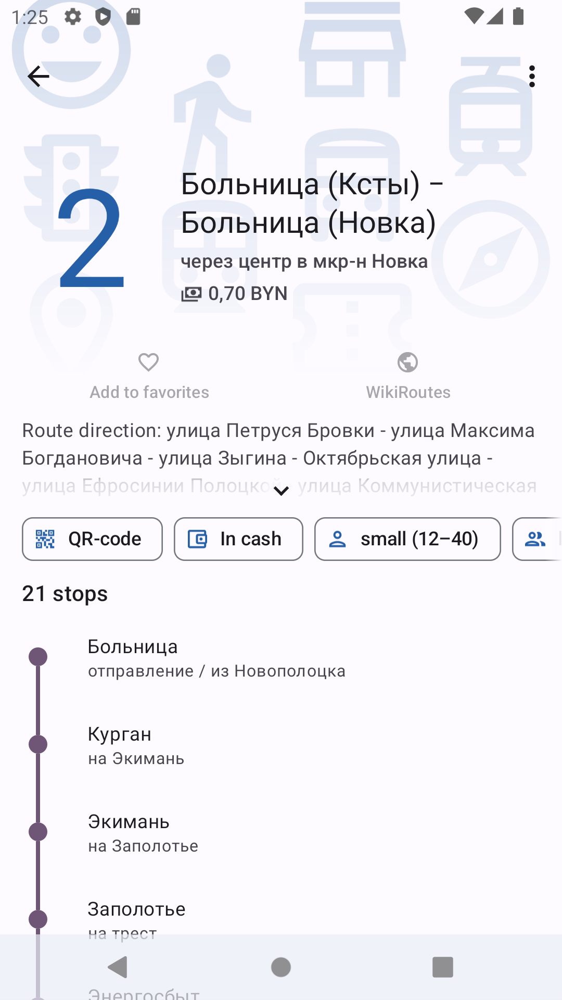
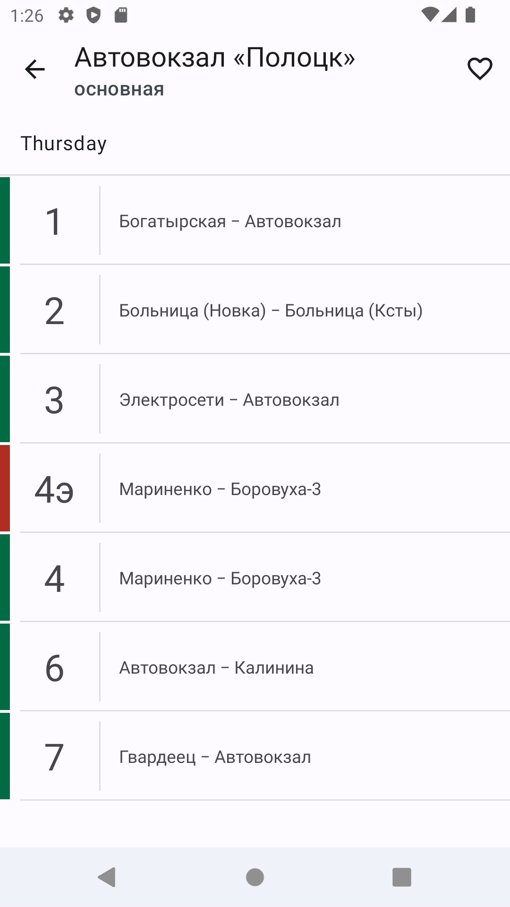
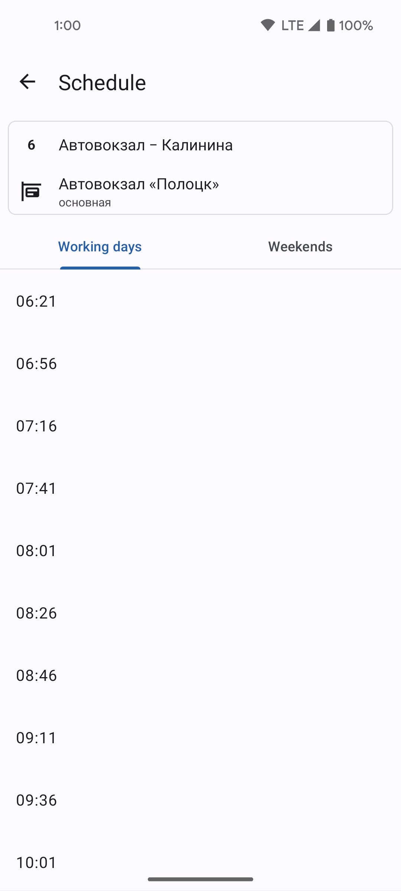
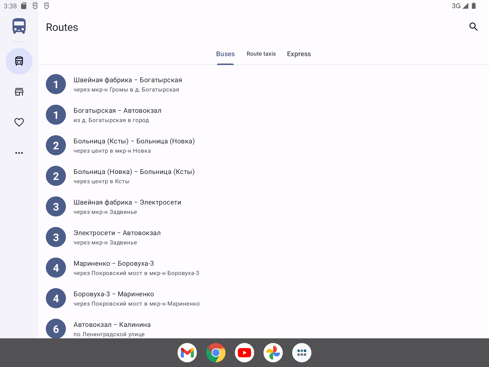
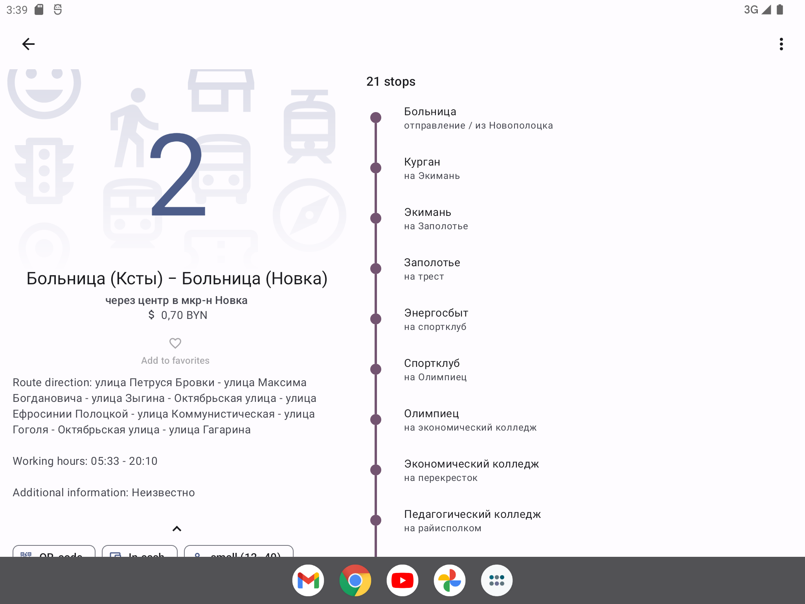

 
  

#  [WIP] RideBus
Completely rewritten application for viewing schedule of public transport of Polotsk, Belarus on Kotlin with new features (in the future, other cities of Belarus). The source code of the old version is available [here](https://github.com/ztimms73/RideBus-legacy).

ToDo:
- [ ] New favorites system (in the old version, favorites are limited to 12 items);
- [ ] Map with stops;
- [ ] Calculation of the optimal route with transfers.

# Screenshots
|  |  |  |
|------------------------------------------------------------|------------------------------------------------------------|------------------------------------------------------------|
|  |  |  |

|  |  |
|--------------------------------------------------------------|--------------------------------------------------------------|

# License

    Copyright 2021 Zakhar Timoshenko
    Copyright 2015 Javier Tomás

    Licensed under the Apache License, Version 2.0 (the "License");
    you may not use this file except in compliance with the License.
    You may obtain a copy of the License at

    http://www.apache.org/licenses/LICENSE-2.0

    Unless required by applicable law or agreed to in writing, software
    distributed under the License is distributed on an "AS IS" BASIS,
    WITHOUT WARRANTIES OR CONDITIONS OF ANY KIND, either express or implied.
    See the License for the specific language governing permissions and
    limitations under the License.
